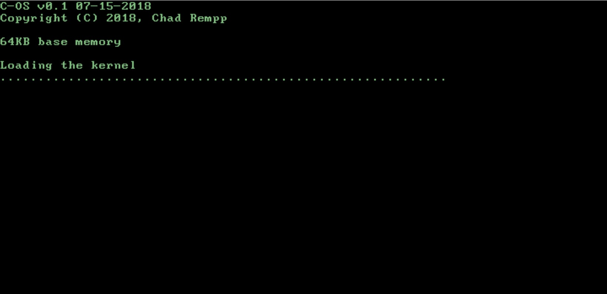

# c-os
The Chad Operating System. [Demo](http://c-os.chadrempp.com/)

<p align="center">
  
</p>

## Inspiration
I've been meaning to read the mini-book [_The little book about OS development_](http://littleosbook.github.io/book.pdf) for a while. I finally got around to it and it made OS development seem simple enough for even me to tackle. The result is this toy OS.

## Requirements (Updated)
Setting up the Watcom build environment is no easy task, especially on Mac. For this reason I've created a [Watcom Docker build image](https://hub.docker.com/r/lapinlabs/watcom/)

The only requirement for building in this way is
* Docker

## Requirements (Old)
These requirements are targeted at Mac. For Windows or Linux the requirements are mostly the same but details will vary.

* X-Code (Mac only, this will bootstrap the building of the cross-compiled gcc)
* Watcom compiler and linker ([see here](docs/watcom.md))
* NASM (`brew install nasm`)
* mkisofs (`brew install cdrtools`)
* bochs ([see here](docs/bochs.md))
* qemu (if you want an alternative tool - `brew install qemu`)

Detailed instructions on environment setup are in the [setup docs](docs/setup.md)

## Build (Old)
We use SCons for building because Make is the worst.

* *Build boot and kernel* `scons`
* *Clean up* `scons -c`

## Build using Docker

Build the c-os image
```
$ docker build -t c-os-build -f Dockerfile.local.build .
```

Run the build image
```
$ docker run --rm -v `pwd`:/app c-os-build
```

## Running
```
$ ~/opt/bochs/bin/bochs -f bochsrc.txt -q
```

## Running using PCJS and Docker
Build the c-os server image
```
$ docker build -t c-os .
```

Run server
```
$ docker run --rm -p 8080:8080 c-os
```

## TODO
1. Get ISO building working again
2. More SCons commands like building ISO or floppy
3. Fix SCons dependencies so I don't have clean all the time
4. Update PCjs to new repo and upgrade

## Docs
* [Development Log](docs/devlog.md)
* [General Memory Map](docs/memory_map.md)
* [C-OS Memory Map](docs/cos_memory_map.md)
* [Installing Bochs from Source](docs/bochs.md)
* [Setting up the Watcom Toolchain on Mac](docs/watcom.md)
* [Setup for C-OS Development](docs/setup.md)
* [Disk Geometries](docs/disk_geometries.md)
* [References](docs/references.md)
